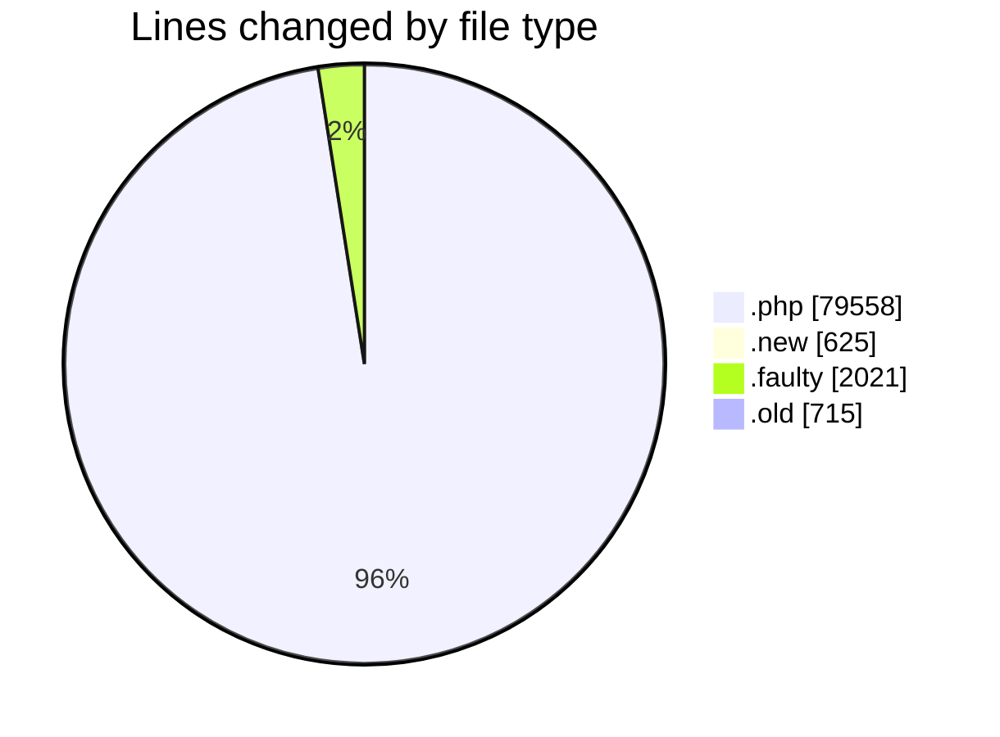
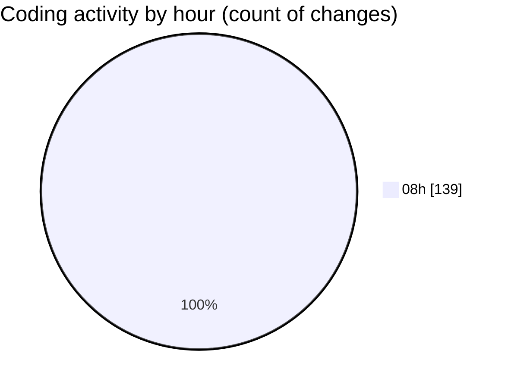

# Zeytoon - Activity Summary 

## Overall Statistics

| Stat                   | Value                                                             |
| ---------------------- | ----------------------------------------------------------------- |
| **Lines Added** (➕)   | 82919                                          |
| **Lines Removed** (➖) | 0                                        |
| **Net Change** (↕)    | 82919                |
| **Active Time** (⌚)   | 101 minutes |

## Modified Files
- **index.php** (+350, -0)
- **home.php** (+140, -0)
- **sync.php** (+306, -0)
- **index.php** (+408, -0)
- **languages.php** (+206, -0)
- **index.php** (+177, -0)
- **zeytoon_customer-send.php** (+926, -0)
- **zeytoon_backup.php** (+243, -0)
- **index.php** (+397, -0)
- **zeytoon_brands-import.php** (+648, -0)
- **userfn7.php** (+2138, -0)
- **zeytoon_inventory-edit.php** (+3488, -0)
- **extraImgs.php** (+171, -0)
- **languages.php** (+200, -0)
- **index.php** (+335, -0)
- **languages.php** (+223, -0)
- **upload.php** (+202, -0)
- **zeytoon_inventory-info.php** (+1746, -0)
- **zeytoon_inventory-import.php.new** (+625, -0)
- **index.php** (+686, -0)
- **zeytoon_inventory-upload.php** (+415, -0)
- **zeytoon_inventory-list-old.php** (+2175, -0)
- **zeytoon_inventory-import.php** (+834, -0)
- **zeytoon_config-general.php** (+1403, -0)
- **index.php** (+655, -0)
- **index.php** (+176, -0)
- **header.inc.php** (+95, -0)
- **telegram.shop.php** (+69, -0)
- **telegram.php.faulty** (+2021, -0)
- **auth.inc.php** (+89, -0)
- **send.php** (+590, -0)
- **telegram.php** (+1781, -0)
- **telegram-incomplete.php** (+2625, -0)
- **functions.inc.php** (+1852, -0)
- **sslSwitch.inc.php** (+75, -0)
- **api.php** (+870, -0)
- **telegram.shop_products.php** (+110, -0)
- **zeytoon_inventory-edit-fast.php** (+3433, -0)
- **telegram.php** (+2320, -0)
- **telegram.php** (+1160, -0)
- **siteDocs.inc.php** (+76, -0)
- **viewPair.inc.php** (+218, -0)
- **price_list.inc.php** (+202, -0)
- **viewCatBrands.inc.php** (+370, -0)
- **viewBrand.inc.php** (+458, -0)
- **index.inc.php** (+466, -0)
- **viewProd.inc.php** (+1113, -0)
- **featured.inc.php** (+90, -0)
- **modules.inc.php** (+46, -0)
- **popularProducts.inc.php** (+82, -0)
- **brands.inc.php** (+51, -0)
- **viewCat.inc.php** (+645, -0)
- **saleItems.inc.php** (+70, -0)
- **viewFavorites.inc.php** (+122, -0)
- **zeytoon_inventory-list.php** (+3787, -0)
- **logout.php** (+60, -0)
- **zeytoon_brands-edit.php** (+1615, -0)
- **requestPass.php** (+109, -0)
- **zeytoon_customer-email.php** (+464, -0)
- **footer.php** (+71, -0)
- **forgotpwd.php** (+408, -0)
- **zeytoon_brands-add.php** (+1510, -0)
- **index.php** (+523, -0)
- **login.php** (+473, -0)
- **zeytoon_category-edit.php** (+1527, -0)
- **login.php** (+226, -0)
- **zeytoon_inventory-import-db.php.old** (+715, -0)
- **zeytoon_inventory-add.php** (+2995, -0)
- **zeytoon_img_idx-add.php** (+709, -0)
- **zeytoon_img_idx-edit.php** (+725, -0)
- **zeytoon_docs-edit.php** (+1042, -0)
- **zeytoon_docs-add.php** (+962, -0)
- **zeytoon_inventory-browse.php** (+391, -0)
- **tax.php** (+212, -0)
- **geo.php** (+306, -0)
- **currency.php** (+204, -0)
- **order.php** (+491, -0)
- **index.php** (+214, -0)
- **index.php** (+522, -0)
- **index.php** (+363, -0)
- **print.php** (+216, -0)
- **options.php** (+572, -0)
- **index.php** (+537, -0)
- **manualsync.php** (+420, -0)
- **index.php** (+338, -0)
- **index.php** (+369, -0)
- **index.php** (+420, -0)
- **index.php** (+334, -0)
- **index.php** (+383, -0)
- **index.php** (+521, -0)
- **index.php** (+355, -0)
- **index.php** (+403, -0)
- **index.php** (+363, -0)
- **index.php** (+139, -0)
- **index.php** (+463, -0)
- **index.php** (+388, -0)
- **index.php** (+387, -0)
- **index.php** (+411, -0)
- **index.php** (+403, -0)
- **index.php** (+394, -0)
- **index.php** (+505, -0)
- **index.php** (+447, -0)
- **index.php** (+496, -0)
- **navigation.inc.php** (+135, -0)
- **index.php** (+109, -0)
- **index.php** (+99, -0)
- **index.php** (+110, -0)
- **index.php** (+383, -0)
- **index.php** (+110, -0)
- **index.php** (+410, -0)
- **email.php** (+225, -0)
- **administrators.php** (+223, -0)
- **index.php** (+336, -0)
- **siteDocs.php** (+221, -0)
- **browse.php** (+167, -0)
- **sef_urls.inc.php** (+478, -0)
- **session.inc.php** (+152, -0)
- **sessionStart.inc.php** (+48, -0)
- **changePass.php** (+87, -0)
- **permissions.php** (+116, -0)
- **reg.inc.php** (+431, -0)
- **login.inc.php** (+216, -0)
- **transfer.inc.php** (+137, -0)
- **transfer.inc.php** (+366, -0)
- **transfer.inc.php** (+500, -0)
- **transfer.inc.php** (+311, -0)
- **tellafriend.inc.php** (+164, -0)
- **transfer.inc.php** (+348, -0)
- **transfer.inc.php** (+193, -0)
- **transfer.inc.php** (+138, -0)
- **transfer.inc.php** (+205, -0)
- **forgotPass.inc.php** (+98, -0)
- **transfer.inc.php** (+519, -0)
- **profile.inc.php** (+278, -0)
- **forecast.inc.php** (+350, -0)
- **zeytoon_order_sum-view-print.php** (+1253, -0)
- **zeytoon_order_sum-view-print-letter.php** (+1151, -0)
- **zeytoon_order_sum-view-print-receipt.php** (+1284, -0)
- **zeytoon_order_sum-view-print-voucher.php** (+1308, -0)

## Visualizations

### By File Type (Lines Changed)

### By Hour (Estimated Activity Count)

> **Last Updated:** 1/9/2025, 8:39:44 AM