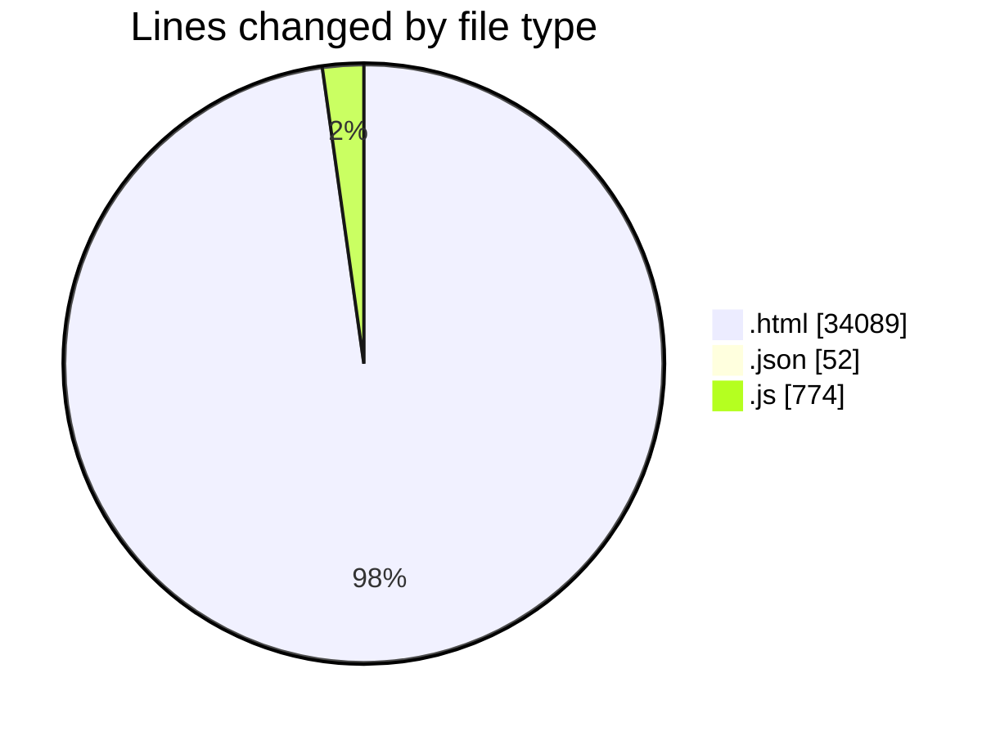
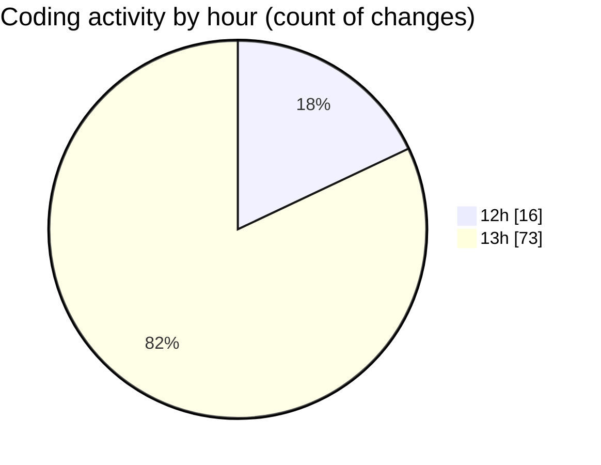

# www - Activity Summary 

## Overall Statistics

| Stat                   | Value                                                             |
| ---------------------- | ----------------------------------------------------------------- |
| **Lines Added** (➕)   | 32328                                          |
| **Lines Removed** (➖) | 2587                                        |
| **Net Change** (↕)    | 29741                |
| **Active Time** (⌚)   | 90 minutes |

## Modified Files
- **index.html** (+11097, -228)
- **header.html** (+74, -12)
- **settings.json** (+52, -0)
- **custom.fa.js** (+774, -0)
- **footer.html** (+243, -61)
- **candidate.html** (+603, -63)
- **countries-Australia.html** (+811, -65)
- **countries-france.html** (+563, -66)
- **countries-germany.html** (+732, -65)
- **countries-italy.html** (+582, -65)
- **countries-malaysia.html** (+675, -65)
- **countries-netherlands.html** (+624, -59)
- **countries-spain.html** (+626, -59)
- **countries-turkey.html** (+562, -65)
- **countries-uk.html** (+561, -65)
- **countries-usa.html** (+684, -65)
- **countries.html** (+551, -65)
- **eanjoman.html** (+405, -65)
- **enamad.html** (+417, -65)
- **events-AI Webinar1.html** (+486, -65)
- **events-details-1.html** (+490, -65)
- **events-economics-2025.html** (+497, -65)
- **events-electrical-2025.html** (+726, -66)
- **events-Finance-2025.html** (+638, -65)
- **events-lifescience-2025.html** (+714, -65)
- **events-mechanic-2025.html** (+743, -65)
- **events.html** (+501, -64)
- **mentoring-mechanic-engineering.html** (+579, -65)
- **mentoring.html** (+361, -64)
- **order-success.html** (+447, -115)
- **profile-details-Abbas-arabi.html** (+547, -59)
- **profile-details-ahmad-bozorgi.html** (+550, -64)
- **profile-details-ahmad-khazayi.html** (+568, -65)
- **profile-details-ahmadreza-mostajabi.html** (+548, -65)
- **profile-details-ahmadreza-nazif.html** (+550, -65)
- **profile-details-aida-rokni.html** (+542, -59)
- **profile-details-ali-araabi.html** (+560, -65)
- **profile-details-ali-darrudi.html** (+561, -65)
- **profile-details-ali-esmaeili.html** (+543, -59)
- **profile-details-ali-fereydooni.html** (+541, -59)

## Visualizations

### By File Type (Lines Changed)

### By Hour (Estimated Activity Count)

> **Last Updated:** 9/16/2025, 1:37:31 PM