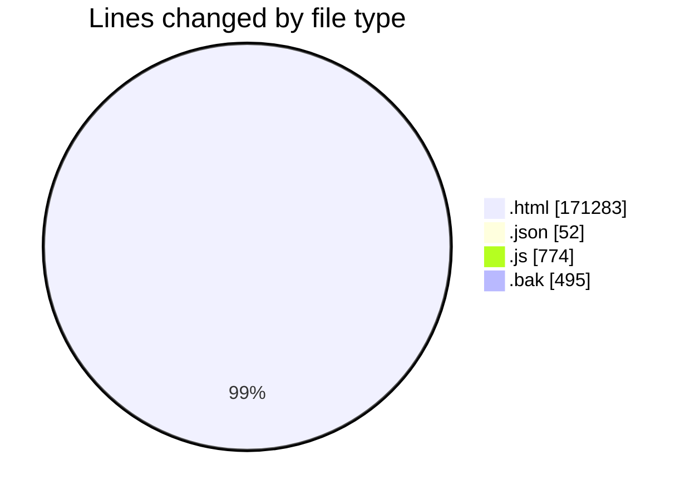
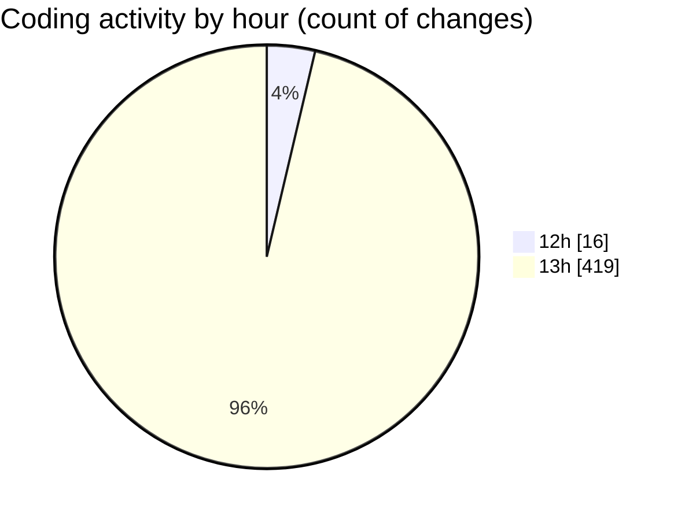

# www - Activity Summary 

## Overall Statistics

| Stat                   | Value                                                             |
| ---------------------- | ----------------------------------------------------------------- |
| **Lines Added** (➕)   | 164371                                          |
| **Lines Removed** (➖) | 8233                                        |
| **Net Change** (↕)    | 156138                |
| **Active Time** (⌚)   | 452 minutes |

## Modified Files
- **index.html** (+11097, -228)
- **header.html** (+74, -12)
- **settings.json** (+52, -0)
- **custom.fa.js** (+774, -0)
- **footer.html** (+243, -61)
- **candidate.html** (+603, -63)
- **countries-Australia.html** (+811, -65)
- **countries-france.html** (+563, -66)
- **countries-germany.html** (+732, -65)
- **countries-italy.html** (+582, -65)
- **countries-malaysia.html** (+675, -65)
- **countries-netherlands.html** (+624, -59)
- **countries-spain.html** (+626, -59)
- **countries-turkey.html** (+562, -65)
- **countries-uk.html** (+561, -65)
- **countries-usa.html** (+684, -65)
- **countries.html** (+551, -65)
- **eanjoman.html** (+405, -65)
- **enamad.html** (+417, -65)
- **events-AI Webinar1.html** (+486, -65)
- **events-details-1.html** (+490, -65)
- **events-economics-2025.html** (+497, -65)
- **events-electrical-2025.html** (+726, -66)
- **events-Finance-2025.html** (+638, -65)
- **events-lifescience-2025.html** (+714, -65)
- **events-mechanic-2025.html** (+743, -65)
- **events.html** (+501, -64)
- **mentoring-mechanic-engineering.html** (+579, -65)
- **mentoring.html** (+361, -64)
- **order-success.html** (+447, -115)
- **profile-details-Abbas-arabi.html** (+547, -59)
- **profile-details-ahmad-bozorgi.html** (+550, -64)
- **profile-details-ahmad-khazayi.html** (+568, -65)
- **profile-details-ahmadreza-mostajabi.html** (+548, -65)
- **profile-details-ahmadreza-nazif.html** (+550, -65)
- **profile-details-aida-rokni.html** (+542, -59)
- **profile-details-ali-araabi.html** (+560, -65)
- **profile-details-ali-darrudi.html** (+561, -65)
- **profile-details-ali-esmaeili.html** (+543, -59)
- **profile-details-ali-fereydooni.html** (+541, -59)
- **profile-details-ali-ghadiri.html** (+550, -65)
- **profile-details-ali-hadjikhani.html** (+577, -65)
- **profile-details-ali-heidari.html** (+548, -65)
- **profile-details-ali-heydari.html** (+561, -65)
- **profile-details-ali-karimi.html** (+568, -65)
- **profile-details-ali-mokhtari.html** (+558, -65)
- **profile-details-ali-tabesh.html** (+548, -65)
- **profile-details-ali-taziki.html** (+572, -87)
- **profile-details-aliakbar-isari.html** (+560, -65)
- **profile-details-alireza-kashian.html** (+564, -65)
- **profile-details-alireza-khodabakhsh.html** (+558, -65)
- **profile-details-alireza-lashkari.html** (+551, -59)
- **profile-details-alireza-malekmohammadi.html** (+560, -65)
- **profile-details-alireza-mohammadidost.html** (+558, -65)
- **profile-details-alireza-mosavian.html** (+561, -65)
- **profile-details-alireza-tavakoli.html** (+537, -59)
- **profile-details-amin-fathi.html** (+543, -59)
- **profile-details-amin-shamseddini.html** (+538, -65)
- **profile-details-amin-yeganeh.html** (+570, -65)
- **profile-details-amir-dehkordi.html** (+550, -65)
- **profile-details-amirali-naeimi.html** (+550, -65)
- **profile-details-amirhossein-sheikhi.html** (+535, -63)
- **profile-details-Amirmohammad-sheikhasadi.html** (+561, -65)
- **profile-details-arad-soutekeshan.html** (+559, -65)
- **profile-details-aref-vakil.html** (+569, -65)
- **profile-details-arefeh-alaei.html** (+558, -65)
- **profile-details-arefeh-ebadati.html** (+556, -65)
- **profile-details-arian-chalay.html** (+551, -65)
- **profile-details-arian-mojaabi.html** (+567, -65)
- **profile-details-arman-farahat.html** (+558, -65)
- **profile-details-armin-hasanirad.html** (+548, -65)
- **profile-details-arsalan-ahmadi.html** (+550, -65)
- **profile-details-atekeh-ebrahimi.html** (+539, -65)
- **profile-details-aylin-jamali.html** (+550, -65)
- **profile-details-Bahare-amoly.html** (+549, -65)
- **profile-details-baharehe-soleimanpour.html** (+563, -59)
- **profile-details-behzad-khajehe.html** (+550, -65)
- **profile-details-bita-homayounimehr.html** (+552, -65)
- **profile-details-danial-amari.html** (+550, -65)
- **profile-details-danial-dashti.html** (+541, -59)
- **profile-details-darian-ghorbanian.html** (+560, -65)
- **profile-details-dina-sedigh.html** (+540, -59)
- **profile-details-ehsan-ghafari.html** (+559, -65)
- **profile-details-ehsan-hosseini.html** (+560, -65)
- **profile-details-ehsan-mohsenitalab.html** (+550, -65)
- **profile-details-ehsan-sabzizade.html** (+570, -65)
- **profile-details-elahe-esfandi.html** (+560, -65)
- **profile-details-elahe-mohammadi.html** (+556, -65)
- **profile-details-elaheh-memari.html** (+548, -65)
- **profile-details-elham-rahmani.html** (+558, -65)
- **profile-details-emad-farjami.html** (+558, -65)
- **profile-details-faezeh-faghi.html** (+549, -65)
- **profile-details-fahimeh-fotouhi.html** (+550, -65)
- **profile-details-farahnaz-ghanbari.html** (+549, -65)
- **profile-details-faranak-heydari.html** (+539, -59)
- **profile-details-fariba-ghaffari.html** (+552, -59)
- **profile-details-farid-moeinifar.html** (+541, -65)
- **profile-details-farshid-evazabadian.html** (+560, -65)
- **profile-details-farzane-sepehr.html** (+560, -65)
- **profile-details-farzane-soltani.html** (+560, -65)
- **profile-details-farzin-banakheiri.html** (+563, -65)
- **profile-details-fateme-rezaei.html** (+569, -65)
- **profile-details-fatemeh-sadeghi.html** (+560, -59)
- **profile-details-fatemeh-safari.html** (+541, -59)
- **profile-details-fereshteh-navidi.html** (+551, -65)
- **profile-details-ghazal-azarfar.html** (+560, -65)
- **profile-details-ghazal-hasani.html** (+548, -65)
- **profile-details-hadis-saadatinezhad.html** (+558, -65)
- **profile-details-hadiseh-eslamian.html** (+546, -65)
- **profile-details-hamed-khaleghi.html** (+542, -65)
- **profile-details-hamid-hosseinianfar.html** (+560, -65)
- **profile-details-hana-saadat.html** (+537, -65)
- **profile-details-hedieh-karachi.html** (+496, -0)
- **profile-details-saba-notash.html** (+475, -0)
- **profile-details-hanieh-gerani.html** (+502, -0)
- **profile-details-hanieh-esmaeili.html** (+488, -0)
- **profile-details-mehrnosh-hasanzadeh.html** (+495, -0)
- **profile-details-mohammad-mirnouri.html** (+493, -0)
- **profile-details-siavash-rahimi.html** (+494, -0)
- **profile-details-mahsa-mirzakhani.html** (+503, -0)
- **profile-details-sarow-saeedi.html** (+494, -0)
- **profile-details-zeinab-sheikhi.html** (+484, -0)
- **profile-details-nastaran-soleimani.html.bak** (+495, -0)
- **profile-details-hosna-eftekhari.html** (+485, -0)
- **profile-details-nasim-sarhadi.html** (+495, -0)
- **profile-details-shadi-bazazordeh.html** (+494, -0)
- **profile-details-sogand-tayebinaz.html** (+503, -0)
- **profile-details-saba-kamali.html** (+493, -0)
- **profile-details-samin-bemanian.html** (+493, -0)
- **profile-details-shahriyar-motahari.html** (+494, -0)
- **profile-details-nasibeh-hedayati.html** (+494, -0)
- **profile-details-maryam-sadeghi.html** (+496, -0)
- **profile-details-saba-nemati.html** (+495, -0)
- **profile-details-sogand-soghrati.html** (+487, -0)
- **profile-details-mehrab-hamidi.html** (+484, -0)
- **profile-details-mehraneh-salimi.html** (+485, -0)
- **profile-details-navid-keshmiri.html** (+496, -0)
- **profile-details-parham-kazemi.html** (+494, -0)
- **profile-details-pantea-fatemi.html** (+494, -0)
- **terms-of-use.html** (+372, -0)
- **profile-details-nobahar-shahidi.html** (+485, -0)
- **profile-details-khatereh-shafaat.html** (+494, -0)
- **profile-details-yasaman-moghadamnia.html** (+503, -0)
- **profile-details-maryam-naeej.html** (+475, -0)
- **profile-details-niloofar-nalaee.html** (+485, -0)
- **profile-details-zahra-samimi.html** (+486, -0)
- **profile-details-setayesh-yazdani.html** (+494, -0)
- **profile-details-samira-mehrabi.html** (+495, -0)
- **profile-details-saeed-arabloo.html** (+486, -0)
- **profile-details-tara-emami.html** (+487, -0)
- **profile-details-romina-shafieha.html** (+496, -0)
- **profile-details-pouya-nobahar.html** (+496, -0)
- **profile-details-reza-radpour.html** (+475, -0)
- **profile-details-reza-nasiri.html** (+496, -0)
- **profile-details-raha-mousavi.html** (+487, -0)
- **profile-details-reza-najafi.html** (+492, -0)
- **profile-details-saba-najjar.html** (+495, -0)
- **profile-details-reza-serati.html** (+496, -0)
- **profile-details-roya-esfandi.html** (+495, -0)
- **profile-details-negin-chegeni.html** (+488, -0)
- **profile-details-nikizahra-moalle.html** (+496, -0)
- **profile-details-saba-shahali.html** (+496, -0)
- **profile-details-niloofar-tavakoli.html** (+496, -0)
- **profile-details-nikta-atabaki.html** (+494, -0)
- **profile-details-niloofar-ghalandari.html** (+484, -0)
- **profile-details-niloofar-sabzehparvar.html** (+486, -0)
- **profile-details-niloofar-kargar.html** (+495, -0)
- **profile-details-parastoo-jafari.html** (+494, -0)
- **profile-details-parisa-mashhadi.html** (+498, -0)
- **profile-details-parisa-zaynali.html** (+486, -0)
- **profile-details-parisa-forutan.html** (+496, -0)
- **profile-details-payam-baharlou.html** (+486, -0)
- **profile-details-pedram-daee.html** (+496, -0)
- **profile-details-pegah-baghani.html** (+476, -0)
- **profile-details-pouria-farajzade.html** (+495, -0)
- **profile-details-mona-nikkhah.html** (+486, -0)
- **profile-details-nazanin-khoramzadeh2.html** (+487, -0)
- **profile-details-nafis-honarmaye.html** (+487, -0)
- **profile-details-nasim-chalaki.html** (+506, -0)
- **profile-details-nastaran-zoghi.html** (+495, -0)
- **profile-details-navid-jabarimani.html** (+484, -0)
- **profile-details-navid-rasekh.html** (+494, -0)
- **profile-details-negar-foulad.html** (+485, -0)
- **profile-details-mohammad-taleghani.html** (+497, -0)
- **profile-details-mohammad-sharifi.html** (+496, -0)
- **profile-details-mohammdmehdi-balouchi.html** (+486, -0)
- **profile-details-mohammadmahdi-tajiki.html** (+513, -0)
- **profile-details-mohammadmehdi-razavi.html** (+488, -0)
- **profile-details-mohammadreza-forotan.html** (+475, -0)
- **profile-details-mohsen-fatehifar.html** (+503, -0)
- **profile-details-mojtaba-mohammadi.html** (+498, -0)
- **profile-details-mohsen-joneidi.html** (+493, -0)
- **profile-details-mohsen-shahverdi.html** (+487, -0)
- **profile-details-mehraneh-seyedan.html** (+474, -0)
- **profile-details-mehdi-amiri.html** (+487, -0)
- **profile-details-mehdi-hajiabadi.html** (+495, -0)
- **profile-details-mehrdad-soltani.html** (+493, -0)
- **profile-details-mehrdad-hessar.html** (+496, -0)
- **profile-details-mohammad-maarefi.html** (+496, -0)
- **profile-details-mina-aghatayeb.html** (+487, -0)
- **profile-details-mobin-jabbarzadeh.html** (+483, -0)
- **profile-details-moein-taherkhani.html** (+487, -0)
- **profile-details-mahsa-ordibehesht.html** (+484, -0)
- **profile-details-mahsa-razavi.html** (+485, -0)
- **profile-details-maryam-nahid.html** (+486, -0)
- **profile-details-majid-maleki.html** (+496, -0)
- **profile-details-mahya-eslami.html** (+486, -0)
- **profile-details-maryam-mousavi.html** (+486, -0)
- **profile-details-maryam-taheri.html** (+486, -0)
- **profile-details-kaveh-numvar.html** (+496, -0)
- **profile-details-matin-zarei.html** (+485, -0)
- **profile-details-kavian-pourrostami.html** (+495, -0)
- **profile-details-kimiya-torkamani.html** (+483, -0)
- **profile-details-khashayar-jafari.html** (+496, -0)
- **profile-details-kiarash-ebrahimi.html** (+486, -0)
- **profile-details-mahsa-forghani.html** (+494, -0)
- **profile-details-kiana-yektansani.html** (+486, -0)
- **profile-details-mahdi-abrishami.html** (+486, -0)
- **profile-details-mahsa-panahi.html** (+487, -0)
- **profile-details-hossein-ali emami.html** (+495, -0)
- **profile-details-hasti-lesani.html** (+487, -0)
- **profile-details-hojat-naderzadeh.html** (+475, -0)
- **profile-details-hooria-hajian.html** (+497, -0)
- **profile-details-hojjat-nazari.html** (+495, -0)
- **profile-details-hossein-saghlatoon.html** (+496, -0)
- **profile-details-hossein-hamishebahar.html** (+496, -0)
- **profile-details-hossein-shiravi.html** (+495, -0)
- **profile-details-jalal-bagherzade.html** (+496, -0)
- **profile-details-javad-soleimani.html** (+498, -0)
- **profile-details-zahra-khalaj.html** (+497, -0)
- **profile-details-zahra-fallah.html** (+495, -0)
- **profile-details-zahra-shams.html** (+488, -0)
- **profile-details-zahra-mohammadinejad.html** (+485, -0)
- **profile-details-zahra-safari.html** (+475, -0)
- **profile-details-Rasool-Heydari.html** (+496, -0)
- **profile-details-zahra-sobhkhiz.html** (+497, -0)
- **profile-details-Mojtaba-NikAyin.html** (+496, -0)
- **profile-details-Yousef-Khayat.html** (+496, -0)
- **profile-details-Sadaf-khalatbari.html** (+485, -0)
- **profile-details-vahid-khorasani.html** (+499, -0)
- **profile-details-sina-fakharmanesh.html** (+496, -0)
- **profile-details-tarokh-shariat.html** (+486, -0)
- **profile-details-vajihe-montazer.html** (+505, -0)
- **profile-details-vahid-nourian.html** (+496, -0)
- **profile-details-yeganeh-hoseini.html** (+495, -0)
- **profile-details-vali-parsaei.html** (+498, -0)
- **profile-details-zahra-bagherian.html** (+487, -0)
- **profile-details-zahra-faham.html** (+494, -0)
- **profile-details-shahin-sabeti.html** (+494, -0)
- **profile-details-saman-arastan.html** (+487, -0)
- **profile-details-saman-jafari1.html** (+488, -0)
- **profile-details-shaghayegh-ghafari.html** (+497, -0)
- **profile-details-shayan-abrishami.html** (+496, -0)
- **profile-details-shakiba-mashini.html** (+486, -0)
- **profile-details-sina-mohammadzadeh.html** (+487, -0)
- **profile-details-sina-dehghan.html** (+478, -0)
- **profile-details-sobhan-sabzizade.html** (+505, -0)
- **profile-details-siavash-rahimi.html** (+494, -0)
- **profile-details-sajjad-ahmadi.html** (+486, -0)
- **profile-details-samad-khani.html** (+494, -0)
- **profile-details-sahar-pourmohammadi.html** (+485, -0)
- **profile-details-sajjad-safarveisi.html** (+504, -0)
- **profile-details-samira-sariraei.html** (+494, -0)
- **profile-details-hossein-etezadi.html** (+541, -58)
- **profile-details-mahsa-yosefi.html** (+542, -58)
- **profile-details-parisa-karbalari.html** (+552, -58)
- **profile-details-mehrab-beikzadeh.html** (+1011, -534)
- **profile-details-roja-talebi.html** (+551, -58)
- **profile-details-reyhaneh-pourasgari.html** (+485, -0)
- **profile-details-nazanin-shahrezaei.html** (+493, -0)
- **profile-details-mahshid-fallah.html** (+490, -0)
- **profile-details-nilofar-adel.html** (+495, -0)
- **profile-details-mehdi-akhbari.html** (+479, -0)
- **profile-details-marzieh-oveysi.html** (+479, -0)
- **profile-details-tahereh-mohammadi.html** (+493, -0)
- **profile-details-sara-rahbaran.html** (+482, -0)
- **profile-details-saeideh-taheri.html** (+491, -0)
- **services-mentoring-group.html** (+710, -0)
- **services-payment-general.html** (+407, -0)
- **profile-details-sahand-rejali.html** (+482, -0)
- **profile-details-kimia-ghazanfari.html** (+480, -0)
- **profile-details-matin-mohebi.html** (+475, -0)
- **profile-details-sara-shahali.html** (+482, -0)
- **profile-details-katayon-arabzadeh.html** (+501, -0)
- **profile-details-sara-tavakoli.html** (+500, -0)
- **profile-details-mohamad-ghasemi.html** (+489, -0)
- **profile-details-nima-mahmoudi.html** (+549, -58)
- **profile-details-mani-bayani.html** (+574, -58)
- **profile-details-mehran-rezvani.html** (+493, -0)
- **profile-details-pouya-hosseini.html** (+494, -0)
- **profile-details-pezhman-sharafdin.html** (+492, -0)
- **profile-details-pouria-zarrin.html** (+484, -0)
- **profile-details-nasim-ebadi.html** (+493, -0)
- **profile-details-pegah-nabipour.html** (+494, -0)
- **profile-details-naghmeh-akhavan.html** (+508, -0)
- **profile-details-mehrdad-mohammadi.html** (+470, -0)
- **profile-details-ramtin-rafatnezhad.html** (+537, -59)
- **services.html** (+358, -65)

## Visualizations

### By File Type (Lines Changed)

### By Hour (Estimated Activity Count)

> **Last Updated:** 9/16/2025, 1:57:31 PM